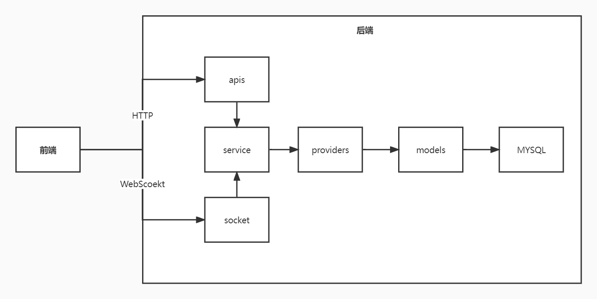

# 运行项目

全局安装 ts-node、typescript、nodemon。

```npm
npm i -g ts-node typescript nodemon
```

# 项目说明

后端项目使用的技术栈：

1. [Knex.js](https://knexjs.org/)：操作数据库的 JavaScript 框架。
2. [Socket.io](https://socket.io/)：即时通讯套接字框架。
3. [Express.js](https://expressjs.com/zh-cn/)：Web 应用程序框架，它类似于 Spring Web。

# 目录说明

1. apis：接口，前端通过接口访问项目。apis 通常与 providers 打交道。
2. providers：数据提供者，专门与数据库打交道的代码。子文件夹 database 存放 knex 的配置文件或 knex 的全局配置。
3. models：数据模型，约束 providers。
4. service：业务处理，专门处理 providers、apis 业务的逻辑代码。
5. socket：前端实时通信的套接字框架。
6. express：Web 服务器开发框架。



# 数据文件

初始所需的 sql 文件都存放在 docs/sql，把数据插入到你的 MySQL 中。数据库的连接配置在 src/providers/database 中更改。
